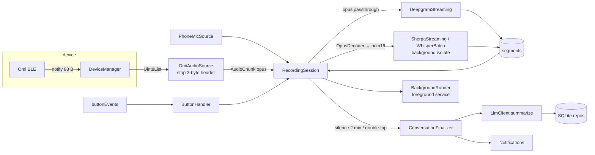

# 03 — Target architecture

Flutter application, Android-first, iOS kept buildable. This document describes the
module layout we migrate *towards*; the first Android build (M1) ships with the upstream
layout unchanged, and M3 performs the refactor described here.

## 1. Layered layout

```
lib/
  main.dart                     bootstrap: settings, notifications, foreground-service init, runApp
  app/                          MaterialApp, theme, routing, top-level providers
  core/                         models, Result/Failure types, logging, clock, ids
  device/                       Omi device transport
    omi_device.dart             abstract OmiDevice (interface)
    omi_ble_device.dart         flutter_blue_plus implementation
    omi_gatt.dart               UUIDs, codec enum, packet parsers (single source of truth)
    fake_omi_device.dart        replay/fake for tests
    device_manager.dart         scan, connect, auto-reconnect w/ backoff, MTU, char cache
  audio/
    audio_source.dart           abstract AudioSource → Stream<AudioChunk>
    omi_audio_source.dart       BLE bytes → header strip → (opus | pcm)
    phone_mic_source.dart       `record` PCM16 16 kHz
    mic_recorder.dart           the recorder slice phone_mic_source needs, + its MicService adapter
    audio_routing.dart          pure: chunk encoding + transcriber encoding → pass / decode / drop
    opus_decoder.dart           opus_flutter wrapper
    wav.dart                    header builder, pcm helpers
  transcription/
    transcriber.dart            abstract StreamingTranscriber / FileTranscriber
    deepgram_streaming.dart
    deepgram_prerecorded.dart   file transcription (SD-card)
    sherpa_streaming.dart       zipformer, runs in isolate
    whisper_batch.dart          offline whisper + Silero VAD, runs in isolate
    model_store.dart            model download / verify / delete, progress
  intelligence/
    llm_client.dart             abstract LlmClient (chat, summarize → ConversationInsights)
    openai_client.dart          OpenAI + any OpenAI-compatible base URL
    prompts.dart
  data/
    db.dart                     sqflite open/migrate (schema v5)
    conversation_repo.dart
    memory_repo.dart
    task_repo.dart
    chat_repo.dart              persisted AI chat history
    finalization_repo.dart      `pending_finalizations` table access (no retry policy)
    settings_repo.dart          SharedPreferences (non-secret) + flutter_secure_storage (keys)
    export_import.dart          JSON export / import
  session/
    recording_session.dart      state machine: idle → listening → holdToAsk → finalizing
    conversation_finalizer.dart summarize → memories/tasks → persist → notify (single implementation)
    button_handler.dart         Omi button event state machine
    silence_detector.dart
  platform/
    background_runner.dart      abstract; android_foreground_runner.dart; ios_noop_runner.dart
    permissions.dart            per-API-level permission flows
    notifications.dart          channels, instant, scheduled
  ui/
    pages/ … (ported from upstream, then iterated)
    widgets/
```

Dependency rule: `ui → session/data/platform → transcription/intelligence/audio/device → core`.
Nothing below `session` imports Flutter widgets. `device`, `audio`, `transcription`,
`intelligence` depend only on their plugin and `core`.

Migration status (LO-30, M3 wave A): `core/` exists with `result.dart`, `clock.dart`,
`ids.dart` and `log.dart`, and `device/omi_gatt.dart` is the single source of truth for the
GATT constants and packet parsers. The data models (`Conversation`, `TranscriptSegment`,
`Memory`, `Task`) are still in `lib/models/conversation.dart` rather than under `core/`:
moving them touches more than twenty importers and would collide with the concurrent
LO-32 work, so the move is deferred to LO-34/LO-35 when those importers are rewritten
anyway. `lib/services/ble/ble_protocol.dart` remains as a one-line re-export of
`device/omi_gatt.dart` so existing imports keep compiling; it is deleted in LO-31.

Transitional exception (LO-32, M3 wave A): `audio/`, `transcription/` and
`intelligence/` were introduced as adapters, so they still import the upstream
`services/*_service.dart` classes they wrap, and `transcription/` imports
`models/conversation.dart` for `TranscriptSegment` until the models move. The
imports disappear as §6's migration moves each service into its module.

Migration status (LO-35, M3 wave B): `data/` exists with `db.dart` (schema v5) and
five repositories, each an instance class taking an already-open `Database` so the
tests can drive it through `sqflite_common_ffi`. `services/database_service.dart`
remains as a static **facade** whose methods forward to those repositories: LO-34
rewrites the callers (`providers/app_provider.dart`, `pages/*`) onto the repositories
directly, and the facade is deleted with the provider. Three consequences of that split
are worth knowing:

- `services/finalization_queue.dart` still owns its own SQL and its own
  `PendingFinalization` type. `data/finalization_repo.dart` is the policy-free table
  access it moves onto in LO-23's follow-up; until then the repository has tests but
  no production caller, which is deliberate rather than an oversight.
- `core/ids.dart` gained `fallbackNotificationId`, the `created_at & 0x7fffffff`
  derivation that `tasks.notification_id` is seeded with. Both `data/task_repo.dart`
  and `services/notification_ids.dart` need it and neither may depend on the other,
  so it sits in the one layer both are allowed to import.
- The data models (`Conversation`, `TranscriptSegment`, `Memory`, `Task`,
  `ChatMessage`) are still in `lib/models/conversation.dart`. LO-30 deferred the move
  to `core/` to LO-34/LO-35; LO-35 defers it again to LO-34, because moving twenty-odd
  importers collides with the concurrent LO-31 work on `app_provider.dart` and the
  pages. The repositories import `models/` in the meantime.

## 2. Key interfaces

```dart
// device/omi_device.dart
abstract class OmiDevice {
  String get id;
  String get name;
  Stream<DeviceConnectionState> get connectionState;
  Stream<Uint8List> get audioPackets;      // raw BLE notification payloads
  Stream<ButtonEvent> get buttonEvents;    // parsed, see 05
  Stream<int> get batteryLevel;
  Future<BleAudioCodec> readCodec();
  Future<DeviceInfo> readDeviceInfo();
  Future<int> readMicGain(); Future<void> writeMicGain(int v);
  Future<int> readLedDim();  Future<void> writeLedDim(int v);
  Future<void> haptic(HapticLevel level);
  OmiStorage? get storage;                 // null when the firmware lacks the storage service
  Future<void> disconnect();
}

// audio/audio_source.dart
class AudioChunk { final Uint8List bytes; final AudioEncoding encoding; final DateTime at; }
abstract class AudioSource { Stream<AudioChunk> start(); Future<void> stop(); }

// transcription/transcriber.dart
abstract class StreamingTranscriber {
  AudioEncoding get acceptedEncoding;      // opus or pcm16 — session picks decoder accordingly
  Future<void> start();
  void feed(AudioChunk chunk);
  Stream<TranscriptSegment> get segments;  // with wall-clock start/end filled in
  Stream<String> get errors;               // backend error messages, for logging/UI
  Future<void> stop();
}
abstract class FileTranscriber { Future<List<TranscriptSegment>> transcribe(File wav); }

// intelligence/llm_client.dart
class ConversationInsights { title; summary; List<String> memories; List<TaskDraft> tasks; }
abstract class LlmClient {
  Future<ConversationInsights> summarize(String transcript, {DateTime? now});
  Future<String> chat(String user, {String? context});
}

// platform/background_runner.dart
abstract class BackgroundRunner {
  Future<void> start({required Set<BackgroundReason> reasons}); // {connectedDevice, microphone}
  Future<void> update(String notificationText);
  Future<void> stop();
}
```

`TranscriptSegment` gains `DateTime startAt/endAt` (wall clock) in addition to the
Deepgram-relative seconds so local transcribers can populate durations
(`01-upstream-analysis.md` §5.4).

Two implementation notes on these interfaces, settled by LO-32:

- Every adapter emits on `StreamController.broadcast(sync: true)`. The upstream
  services deliver transcripts through constructor callbacks that run synchronously
  inside the audio callback; an async hop would let a button event run between a
  segment's arrival and its delivery, reordering hold-to-ask accumulation against
  the button state machine.
- `PhoneMicSource` adds `Future<void> prepare()` alongside `AudioSource.start()`.
  `start()` is synchronous by contract and therefore cannot throw a recorder
  failure (permission denied, microphone busy) back at the caller, and the session
  has to see that failure as an exception in order to roll itself back. `start()`
  calls `prepare()` too — the recorder is idempotent — so a caller holding only the
  `AudioSource` interface still works, with the failure surfacing as a stream error.

## 3. Runtime data flow



## 4. Session state machine

```
idle ──connect & keys ok──▶ listening ──single tap──▶ holdToAsk ──single tap──▶ answering ──▶ listening
  ▲                            │ silence 2 min / double tap / stop
  └────────── stop ────────────┴──▶ finalizing ──▶ (listening | idle)
```

- `listening`: audio flows to the active transcriber; segments append to the current
  conversation; every segment resets the silence timer.
- `holdToAsk`: segments are additionally accumulated into the query buffer; overlay shown.
- `answering`: transcription of the main conversation is paused; LLM chat runs; result
  is delivered as a notification and (new) appended to the chat page.
- `finalizing`: the current conversation is handed to `ConversationFinalizer`
  asynchronously; a new empty conversation starts immediately so listening never stops.

## 5. Android background execution design

Requirements: keep BLE streaming, transcription, and finalization alive with the screen
off or the app in the background, for hours, on a single charge.

Design (M2):

1. `AndroidForegroundRunner` wraps `flutter_foreground_task`. It starts a foreground
   service before the session enters `listening` and stops it when the session returns
   to `idle` — whether or not a device is still connected, because an idle app must show
   no persistent notification (LO-24). The manifest declares
   `foregroundServiceType="connectedDevice|microphone"`, but each start requests only the
   types that session needs: `connectedDevice` for an Omi session, plus `microphone` for a
   phone-mic session. The service notification shows connection state and the current
   conversation length; it is the user's "the app is alive" indicator.
2. The service **does not run separate Dart logic**; it exists to keep the Flutter
   engine's main isolate unfrozen. All BLE callbacks continue in the main isolate. (This
   is the same model the official Omi app used before adding a native service.)
3. On start, request `REQUEST_IGNORE_BATTERY_OPTIMIZATIONS` once, explain why, and show
   OEM-specific guidance if the user declines.
4. Hold a partial wake lock while listening (`flutter_foreground_task` option).
5. Reconnect: `DeviceManager` uses `autoConnect: true` for the saved device and an
   exponential backoff (5 s → 60 s, ±10 % jitter) for *re-arming* that request, instead
   of the upstream fixed 5-second timer. The backoff never scans: an armed
   `autoConnect` is retried by the OS itself, so a re-arm is only needed when the
   request could not be placed at all. Watch for the silent refusals: the Android
   plugin returns without registering the request when the device is already
   connected or already connecting, and Dart cannot see that — so only ever arm from
   a disconnected state, or the app ends up believing in a request that does not
   exist. See `services/ble/reconnect_backoff.dart` (LO-22).
6. STT in a background isolate (M4) so a 16 kHz decode loop never blocks the UI or the
   BLE callback queue.

Not in scope for v1: boot receiver, companion-device pairing, native Kotlin service.

## 6. Migration plan from upstream code

| Upstream | Action |
|----------|--------|
| `services/ble_service.dart` | Split into `omi_gatt.dart` (constants, parsers) + `omi_ble_device.dart` + `device_manager.dart`. Add MTU, char cache, subscription cleanup, backoff. |
| `services/opus_decoder_service.dart` | LO-32 wrapped it as `audio/opus_decoder.dart`; the service still holds the `opus_flutter` code until it moves. |
| `services/mic_service.dart` | LO-32 put `audio/phone_mic_source.dart` in front of it behind `AudioSource` (via `audio/mic_recorder.dart`); the recorder itself still lives in `services/`. |
| `services/deepgram_service.dart` | LO-32 wrapped it as `transcription/deepgram_streaming.dart` behind `StreamingTranscriber`. Still to move: the service body, plus fix usage accounting, make the model configurable, add `deepgram_prerecorded.dart`. |
| `services/sherpa_service.dart`, `whisper_service.dart` | LO-32 wrapped them as `transcription/sherpa_streaming.dart` / `whisper_batch.dart`. Still to move: the service bodies, extract model download into `model_store.dart`, add timestamps, add VAD to whisper, move decode into an isolate (M4). |
| `services/openai_service.dart` | LO-32 wrapped it in `intelligence/openai_client.dart` behind `LlmClient` with typed `ConversationInsights` and retryable/permanent errors; the HTTP service itself still lives in `services/` until the base-URL setting lands. |
| `services/database_service.dart`, `models/` | LO-35 split the SQL into `data/` repos behind an unchanged `DatabaseService` facade; schema v5 adds `tasks.notification_id` (backfilled with the pre-v5 `created_at & 0x7fffffff` derivation) and puts `chat_messages` on the migration path so chat is persisted. `start_at/end_at` on segments live in the transcript JSON, so they needed no table change. Still to do: move the models to `core/` and delete the facade with `AppProvider` (LO-34). |
| `services/settings_service.dart` | Copy → `data/settings_repo.dart`; keys move to secure storage with one-time migration. |
| `services/notification_service.dart` | Copy → `platform/notifications.dart`; stable numeric IDs now come from the `tasks.notification_id` column (LO-35), read via `services/notification_ids.dart`; Android res added. |
| `services/sdcard_sync_service.dart` | Copy → `device/omi_storage.dart` (transfer) + `session/sdcard_import.dart` (post-processing via `FileTranscriber` + `ConversationFinalizer`). |
| `providers/app_provider.dart` | Dissolve into `session/*` + three thin `ChangeNotifier`s for UI: `DeviceController`, `SessionController`, `LibraryController` (+ `ChatController`). |
| `pages/*` | Port unchanged in M1; re-point to the new controllers in M3. |
| `OmiLocal/`, Finder duplicates, iCloud toggle | Drop. |

## 7. Testing strategy

- **Unit**: packet parsers (`omi_gatt.dart`), button state machine, silence detector,
  finalizer (with fake `LlmClient`), repos (sqflite_common_ffi on desktop).
- **Replay**: `FakeOmiDevice` replays a captured BLE session (`test/fixtures/*.bin`,
  recorded once from a real device via a debug "capture" toggle) so the whole pipeline
  from bytes to SQLite runs on a laptop without hardware.
- **Device smoke checklist**: `08-dev-workflow.md` §5, executed before every release.
