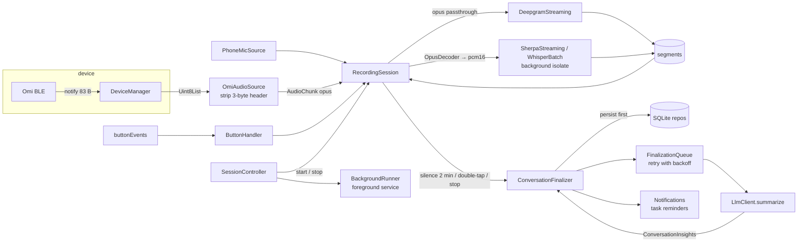

# 03 — Target architecture

Flutter application, Android-first, iOS kept buildable. This document describes the
module layout we migrate *towards*; the first Android build (M1) ships with the upstream
layout unchanged, and M3 performs the refactor described here.

## 1. Layered layout

```
lib/
  main.dart                     bootstrap: settings, notifications, foreground-service init, runApp
  app/                          MaterialApp, theme, routing, top-level providers
  controllers/                  the ChangeNotifiers the pages read (LO-34)
    device_controller.dart      scanning, connection, battery, auto-reconnect, SD-card presence
    session_controller.dart     listening, transcriber choice, foreground service, finalization
    library_controller.dart     conversations / memories / tasks lists and their CRUD
    chat_controller.dart        chat history (persisted) and the LLM chat call
    sdcard_controller.dart      SD-card page state: pending WAL, transfer, imports (LO-52)
  core/                         models, Result/Failure types, logging, clock, ids
  device/                       Omi device transport
    omi_device.dart             abstract OmiDevice (interface) + DeviceConnectionState
    omi_storage.dart            abstract OmiStorage (SD-card sub-interface)
    omi_ble_device.dart         flutter_blue_plus implementation (adapter over BleService)
    omi_gatt.dart               UUIDs, codec enum, packet parsers (single source of truth)
    fake_omi_device.dart        replay/fake for tests + the capture line codec
    ble_session_capture.dart    debug "Capture BLE session" recorder
    device_manager.dart         scan, connect, saved device, current OmiDevice
  audio/
    audio_source.dart           abstract AudioSource → Stream<AudioChunk>
    omi_audio_source.dart       BLE bytes → header strip → (opus | pcm)
    phone_mic_source.dart       `record` PCM16 16 kHz
    mic_recorder.dart           the recorder slice phone_mic_source needs, + its MicService adapter
    audio_routing.dart          pure: chunk encoding + transcriber encoding → pass / decode / drop
    opus_decoder.dart           opus_flutter wrapper
    wav.dart                    header builder, pcm helpers
  transcription/
    transcriber.dart            abstract StreamingTranscriber / FileTranscriber
    deepgram_streaming.dart
    deepgram_prerecorded.dart   file transcription (SD-card)
    isolate_channel.dart        request/response + events over Isolate.spawn
    sherpa_streaming.dart       zipformer (en/ko), runs in isolate
    sherpa_worker.dart          the streaming worker isolate; imports sherpa_onnx
    whisper_batch.dart          offline whisper + Silero VAD, runs in isolate
    whisper_worker.dart         the batch worker isolate; imports sherpa_onnx
    vad.dart                    Silero VAD abstraction + sample-index timeline
    model_catalog.dart          catalog of installable models: id, url, required files, sizes,
                                language; maps the local-STT language to a streaming model
    model_store.dart            model download / verify / delete, progress
  intelligence/
    llm_client.dart             abstract LlmClient (chat, summarize → ConversationInsights)
    openai_client.dart          OpenAI + any OpenAI-compatible base URL
    prompts.dart
  data/
    db.dart                     sqflite open/migrate (schema v5)
    conversation_repo.dart
    memory_repo.dart
    task_repo.dart
    chat_repo.dart              persisted AI chat history
    finalization_repo.dart      `pending_finalizations` table access (no retry policy)
    settings_repo.dart          SharedPreferences (non-secret) + flutter_secure_storage (keys)
    export_import.dart          JSON export / import
  session/
    session_state.dart          the SessionState enum the state machine below is drawn in
    recording_session.dart      state machine: idle → listening → holdToAsk → finalizing
    conversation_finalizer.dart summarize → memories/tasks → persist → notify (single implementation)
    sdcard_import.dart          synced `.bin` → PCM16 → WAV → FileTranscriber → finalizer (LO-51)
    button_handler.dart         Omi button event state machine
    silence_detector.dart
  platform/
    background_runner.dart      abstract; android_foreground_runner.dart; ios_noop_runner.dart
    ble_capture_file.dart       where a debug BLE session capture is written
    permissions.dart            per-API-level permission flows
    notifications.dart          channels, instant, scheduled
  ui/
    pages/ … (ported from upstream, then iterated)
    widgets/
```

Dependency rule: `ui → controllers → session/data/platform →
transcription/intelligence/audio/device → core`. `controllers/` is where the pages'
`ChangeNotifier`s live and the only layer allowed to combine several of the ones below it.
Nothing below `session` imports Flutter widgets. `device`, `audio`, `transcription`,
`intelligence` depend only on their plugin and `core`.

Migration status (LO-30, M3 wave A): `core/` exists with `result.dart`, `clock.dart`,
`ids.dart` and `log.dart`, and `device/omi_gatt.dart` is the single source of truth for the
GATT constants and packet parsers. The data models (`Conversation`, `TranscriptSegment`,
`Memory`, `Task`) are still in `lib/models/conversation.dart` rather than under `core/`:
moving them touches more than twenty importers and would have collided with the concurrent
LO-32 work. LO-30 deferred the move to LO-34/LO-35, but neither took it on — see the LO-35
note below — so it still needs an issue of its own. `lib/services/ble/ble_protocol.dart`, the one-line re-export that kept
the pre-LO-30 imports compiling, was deleted in LO-31.

Migration status (LO-33, M3 wave C): `session/` exists and owns the state machine of §4.
The composition root it was introduced under, `providers/app_provider.dart`, was dissolved
by LO-34 (below); `SessionController` is what now builds the transcriber for the selected
mode, holds the microphone permission and the foreground service, and delegates the rest to
`RecordingSession`. `ConversationFinalizer` still takes a `Future<Database>` and builds the
three repos per call, because the process-wide database is opened lazily; injecting the
repos themselves is still open.

Migration status (LO-40, M4 wave A): `transcription/model_store.dart` and
`model_catalog.dart` now exist and own model download, verification and delete.
`services/sherpa_service.dart` and `services/whisper_service.dart` no longer download
anything: each takes an optional model directory and, when none is injected, falls back to
resolving the installed directory from a `ModelStore` itself. That last fallback makes the
transitional arrow below temporarily bidirectional — `transcription/` adapters wrap the two
services, and those services now import `transcription/model_store.dart` back. It
disappears with the same migration: once the services move under `transcription/`, only one
direction is left. Taking a required directory instead would have removed it today, but at
the cost of editing the two adapter files LO-41 is rewriting in parallel.

Transitional exception (LO-32, M3 wave A): `audio/`, `transcription/` and
`intelligence/` were introduced as adapters, so they still import the upstream
`services/*_service.dart` classes they wrap, and `transcription/` imports
`models/conversation.dart` for `TranscriptSegment` until the models move. The
imports disappear as §6's migration moves each service into its module.
`transcription/sherpa_streaming.dart` is the first one out: LO-41 rewrote it on
top of `sherpa_worker.dart`, so it no longer imports `services/sherpa_service.dart`,
and it reaches no plugin of its own — a caller-supplied `modelDir` wins, and
otherwise LO-40's `ModelStore` resolves where `ModelCatalog.defaultStreaming` is
installed.

Migration status (LO-35, M3 wave B): `data/` exists with `db.dart` (schema v5) and
five repositories, each an instance class taking an already-open `Database` so the
tests can drive it through `sqflite_common_ffi`. `services/database_service.dart`
remains as a static **facade** whose methods forward to those repositories. LO-34 moved
every caller under `lib/` onto the repositories directly, so the facade now has no
production callers at all — only `test/services/database_service_test.dart` and
`test/services/database_migration_test.dart` still exercise it, and deleting it is a
follow-up that has to rewrite or drop those. Three consequences of that split are worth
knowing:

- `services/finalization_queue.dart` reads and writes every row through
  `data/finalization_repo.dart` (LO-33). The repo stays policy-free: backoff,
  `maxAttempts` and the "held" predicate live in the queue, the last of them as an
  extension the queue declares on `PendingFinalizationRow`. The queue's own
  `PendingFinalization` type is gone.
- `core/ids.dart` gained `fallbackNotificationId`, the `created_at & 0x7fffffff`
  derivation that `tasks.notification_id` is seeded with. Both `data/task_repo.dart`
  and `services/notification_ids.dart` need it and neither may depend on the other,
  so it sits in the one layer both are allowed to import.
- The data models (`Conversation`, `TranscriptSegment`, `Memory`, `Task`,
  `ChatMessage`) are still in `lib/models/conversation.dart`. LO-30 deferred the move
  to `core/` to LO-34/LO-35 and LO-35 deferred it again to LO-34, but LO-34's scope was
  the controller split alone and it did not move them either: the move touches twenty-odd
  importers and is independent of where the UI reads its state from. It now needs an issue
  of its own. The repositories import `models/` in the meantime.

Migration status (LO-34, M3 wave D): `providers/app_provider.dart` is gone and
`lib/controllers/` holds the four `ChangeNotifier`s the pages read. The dependency
between them runs one way — `DeviceController` → `SessionController` →
{`DeviceManager`, `LibraryController`, `ChatController`}, and `ChatController` →
`LibraryController` — so the connection-state listener that used to sequence
"battery, storage probe, auto-start" and "grace window, stop, reconnect ladder"
inside the provider now lives in `DeviceController` alone, calling `SessionController`
in the same order. `SessionController` never names `DeviceController`; the one call it
needs in the other direction (the audio self-test's "connect to my saved device") is a
`ensureSavedDeviceConnection` callback that `main.dart` assigns. `main.dart` is the
composition root: `LibreOmiApp` builds the four controllers, wires that callback, and
runs a bootstrap that reproduces the old `AppProvider._init()` order — reap a stale
foreground service, `DeviceController.init()`, the library loads, the chat history load,
then `SessionController.init()` for the finalization queue. Two things are new rather
than moved: chat messages are persisted through `data/chat_repo.dart` (schema v5 had the
table since LO-35 but nothing wrote to it), and `LibraryController` owns the export that
`DatabaseService.exportAllData` used to serve. What LO-34 deliberately did *not* do is
move the data models to `core/` — see the LO-35 note above.

Migration status (LO-31, M3 wave B): `device/` now holds the `OmiDevice` and
`OmiStorage` interfaces, an `OmiBleDevice`/`OmiBleStorage`/`BleDeviceHost`
adapter trio over `services/ble_service.dart`, a `DeviceManager` that owns
scanning, connecting, the saved device and the current `OmiDevice`, and a
`FakeOmiDevice` that replays a captured session. `controllers/device_controller.dart`,
`pages/home_page.dart`, `pages/device_settings_page.dart` and
`services/sdcard_sync_service.dart` reach the wearable only through those, and
`services/ble/ble_protocol.dart` is gone. Two transitional exceptions remain:
`omi_ble_device.dart` is the one file under `device/` allowed to import
`flutter_blue_plus` and `services/ble_service.dart` (the service keeps the
connection, MTU and reconnect logic stabilised by LO-22/LO-16, which cannot be
re-verified without hardware), and the auto-reconnect backoff lives in
`DeviceController` rather than in `device/` itself (LO-34). Since LO-50 `SdCardSyncService` consumes `OmiStorage.packets` and drives the
pure `services/sdcard_transfer.dart` state machine, so no code above `device/`
switches on raw notification lengths any more; `rawPackets` remains only for
the BLE session capture and manual debugging.

## 2. Key interfaces

```dart
// device/omi_device.dart
abstract class OmiDevice {
  String get id;
  String get name;
  Stream<DeviceConnectionState> get connectionState;
  DeviceConnectionState get state;
  Stream<Uint8List> get audioPackets;      // raw BLE notification payloads
  Stream<ButtonEvent> get buttonEvents;    // parsed, see 05
  Stream<int> get batteryLevel;
  Future<void> startAudioStream();         // the session decides when audio flows
  Future<void> stopAudioStream();
  Future<BleAudioCodec> readCodec();
  Future<DeviceInfo> readDeviceInfo();
  Future<int?> readBatteryLevel();         // also emitted on batteryLevel
  Future<int?> readMicGain(); Future<void> writeMicGain(int v);
  Future<int?> readLedDim();  Future<void> writeLedDim(int v);
  Future<void> haptic(HapticLevel level);
  OmiStorage? get storage;                 // null when the firmware lacks the storage service
  Future<void> disconnect();
}

// device/omi_storage.dart
abstract class OmiStorage {
  Future<List<int>> list();                // [totalBytes, offset]; [] = no storage service
  Future<void> startStream(); Future<void> stopStream();
  Future<bool> startRead(int offset, {int fileNumber});
  Future<bool> stopRead();                 // bare 0x03; ends a transfer in flight
  Future<bool> clear({int fileNumber});
  Stream<List<int>> get rawPackets;        // untouched bytes, kept for capture/debugging
  Stream<StoragePacket> get packets;       // rawPackets through parseStoragePacket
}

// audio/audio_source.dart
class AudioChunk { final Uint8List bytes; final AudioEncoding encoding; final DateTime at; }
abstract class AudioSource { Stream<AudioChunk> start(); Future<void> stop(); }

// transcription/transcriber.dart
abstract class StreamingTranscriber {
  AudioEncoding get acceptedEncoding;      // opus or pcm16 — session picks decoder accordingly
  Future<void> start();
  void feed(AudioChunk chunk);
  Stream<TranscriptSegment> get segments;  // with wall-clock start/end filled in
  Stream<String> get errors;               // backend error messages, for logging/UI
  Future<void> stop();
}
abstract class FileTranscriber { Future<List<TranscriptSegment>> transcribe(File wav); }

// intelligence/llm_client.dart
class ConversationInsights { title; summary; List<String> memories; List<TaskDraft> tasks; }
abstract class LlmClient {
  Future<ConversationInsights> summarize(String transcript, {DateTime? now});
  Future<String> chat(String user, {String? context});
}

// platform/background_runner.dart
abstract class BackgroundRunner {
  Future<void> start({required Set<BackgroundReason> reasons}); // {connectedDevice, microphone}
  Future<void> update(String notificationText);
  Future<void> stop();
}
```

`TranscriptSegment` gains `DateTime startAt/endAt` (wall clock) in addition to the
Deepgram-relative seconds so local transcribers can populate durations
(`01-upstream-analysis.md` §5.4).

Two implementation notes on these interfaces, settled by LO-32:

- Every adapter emits on `StreamController.broadcast(sync: true)`. The upstream
  services deliver transcripts through constructor callbacks that run synchronously
  inside the audio callback; an async hop would let a button event run between a
  segment's arrival and its delivery, reordering hold-to-ask accumulation against
  the button state machine.
- `startAudioStream`/`stopAudioStream` and `readBatteryLevel` are on the
  interface, though the sketch above did not originally list them (LO-31).
  Audio notification subscription is a session decision, not a connection one —
  `RecordingSession` starts and stops it while the link stays up — and the
  battery characteristic is read on demand rather than notified, so a stream
  alone could not reproduce the existing behaviour. `batteryLevel` still emits
  every value a read produces, so a UI can subscribe instead of polling.
- `OmiBleDevice.storage` is never null in practice: the BLE adapter cannot know
  whether the firmware has the storage service until something reads it, so
  absence shows up as `list()` returning `[]` — which is exactly how
  `DeviceController` decides whether SD-card sync is available.
- `PhoneMicSource` adds `Future<void> prepare()` alongside `AudioSource.start()`.
  `start()` is synchronous by contract and therefore cannot throw a recorder
  failure (permission denied, microphone busy) back at the caller, and the session
  has to see that failure as an exception in order to roll itself back. `start()`
  calls `prepare()` too — the recorder is idempotent — so a caller holding only the
  `AudioSource` interface still works, with the failure surfacing as a stream error.

## 3. Runtime data flow



## 4. Session state machine

```
idle ──connect & keys ok──▶ listening ──single tap──▶ holdToAsk ──single tap──▶ answering ──▶ listening
  ▲                            │ silence 2 min / double tap / stop
  └────────── stop ────────────┴──▶ finalizing ──▶ (listening | idle)
```

- `listening`: audio flows to the active transcriber; segments append to the current
  conversation; every segment resets the silence timer.
- `holdToAsk`: segments are additionally accumulated into the query buffer *and* into the
  conversation — the question was said out loud in the room. Overlay shown.
- `answering`: transcription of the main conversation is paused (incoming audio is
  dropped, not buffered); LLM chat runs; the result is delivered as a notification and
  appended to the chat page, together with the question it answers, so the chat page does
  not fill up with orphan replies (LO-33, issue #33).
- `finalizing`: the current conversation is handed to `ConversationFinalizer`
  asynchronously; a new empty conversation starts immediately so listening never stops.
  The state it returns to is the one it interrupted: `listening` normally, `holdToAsk`
  when a double tap saved in the middle of a query (the query is not abandoned), and
  `idle` when the session is stopping.

`RecordingSession` owns the machine above, the live segment list, the silence timeout, the
button gestures and the hold-to-ask exchange. It does *not* own the pieces that need
`SettingsService`, runtime permissions or the Android foreground service: which transcriber
the selected mode calls for, the microphone permission, and bringing the foreground service
up before any audio flows (docs/04 §4) stay in `controllers/session_controller.dart`. That
controller supplies the transcriber as a `TranscriberFactory` at construction and hands the
ready-made `AudioSource` — plus the pair of callbacks that open and close the audio
transport under it — to `RecordingSession.start()`. That is what keeps `lib/session` free of platform and
settings dependencies, per the dependency rule in §1.

`ConversationFinalizer` is the single implementation both the live path and the SD-card
import path (`processLocalAudioFile`) go through: persist immediately with a placeholder
title, hand the summarisation to `FinalizationQueue`, and — when the queue finally
succeeds — apply the title, summary, deduplicated memories and tasks, and schedule the
reminders. The queue classifies failures by `LlmRetryableException` / `LlmPermanentException`
rather than by inspecting the result (LO-33).

## 5. Android background execution design

Requirements: keep BLE streaming, transcription, and finalization alive with the screen
off or the app in the background, for hours, on a single charge.

Design (M2):

1. `AndroidForegroundRunner` wraps `flutter_foreground_task`. It starts a foreground
   service before the session enters `listening` and stops it when the session returns
   to `idle` — whether or not a device is still connected, because an idle app must show
   no persistent notification (LO-24). The manifest declares
   `foregroundServiceType="connectedDevice|microphone"`, but each start requests only the
   types that session needs: `connectedDevice` for an Omi session, plus `microphone` for a
   phone-mic session. The service notification shows connection state and the current
   conversation length; it is the user's "the app is alive" indicator.
2. The service **does not run separate Dart logic**; it exists to keep the Flutter
   engine's main isolate unfrozen. All BLE callbacks continue in the main isolate. (This
   is the same model the official Omi app used before adding a native service.)
3. On start, request `REQUEST_IGNORE_BATTERY_OPTIMIZATIONS` once, explain why, and show
   OEM-specific guidance if the user declines.
4. Hold a partial wake lock while listening (`flutter_foreground_task` option).
5. Reconnect: `DeviceManager` uses `autoConnect: true` for the saved device and an
   exponential backoff (5 s → 60 s, ±10 % jitter) for *re-arming* that request, instead
   of the upstream fixed 5-second timer. The backoff never scans: an armed
   `autoConnect` is retried by the OS itself, so a re-arm is only needed when the
   request could not be placed at all. Watch for the silent refusals: the Android
   plugin returns without registering the request when the device is already
   connected or already connecting, and Dart cannot see that — so only ever arm from
   a disconnected state, or the app ends up believing in a request that does not
   exist. See `services/ble/reconnect_backoff.dart` (LO-22).
6. STT in a background isolate (M4) so a 16 kHz decode loop never blocks the UI or the
   BLE callback queue. Done for sherpa in LO-41 (`transcription/isolate_channel.dart`
   + `sherpa_worker.dart`); whisper still decodes on the main isolate until LO-42.

Not in scope for v1: boot receiver, companion-device pairing, native Kotlin service.

## 6. Migration plan from upstream code

| Upstream | Action |
|----------|--------|
| `services/ble_service.dart` | LO-30 extracted `omi_gatt.dart` (constants, parsers); LO-31 put `omi_ble_device.dart` + `device_manager.dart` in front of it behind `OmiDevice`/`OmiStorage`, so nothing above `device/` names it any more. Still to move: the connection, MTU, characteristic-cache and reconnect code itself, once there is hardware to re-verify it against. |
| `services/opus_decoder_service.dart` | LO-32 wrapped it as `audio/opus_decoder.dart`; the service still holds the `opus_flutter` code until it moves. |
| `services/mic_service.dart` | LO-32 put `audio/phone_mic_source.dart` in front of it behind `AudioSource` (via `audio/mic_recorder.dart`); the recorder itself still lives in `services/`. |
| `services/deepgram_service.dart` | LO-32 wrapped it as `transcription/deepgram_streaming.dart` behind `StreamingTranscriber`. LO-51 added the pre-recorded sibling `transcription/deepgram_prerecorded.dart` (a `FileTranscriber` that uploads a WAV to `POST /v1/listen`), and both now share the word-to-segment grouping in `services/deepgram/deepgram_parser.dart` (`segmentsFromDeepgramWords`). Still to move: the streaming service body, plus fix its usage accounting and make the streaming model configurable. |
| `services/sherpa_service.dart`, `whisper_service.dart` | **Done (LO-51).** LO-32 wrapped them as `transcription/sherpa_streaming.dart` / `whisper_batch.dart`; LO-41 moved the sherpa decode loop into `transcription/sherpa_worker.dart` and LO-42 the whisper one into `transcription/whisper_worker.dart`, cutting utterances with the Silero VAD in `transcription/vad.dart` instead of the old fixed 3-second timer. That left both services with a single caller each — the file-transcription stubs in `SessionController` — and LO-51 replaced those with `transcription/offline_file_transcriber.dart`, so both files are deleted. |
| `services/openai_service.dart` | LO-32 wrapped it in `intelligence/openai_client.dart` behind `LlmClient` with typed `ConversationInsights` and retryable/permanent errors; the HTTP service itself still lives in `services/` until the base-URL setting lands. |
| `services/database_service.dart`, `models/` | LO-35 split the SQL into `data/` repos behind an unchanged `DatabaseService` facade; schema v5 adds `tasks.notification_id` (backfilled with the pre-v5 `created_at & 0x7fffffff` derivation) and puts `chat_messages` on the migration path so chat is persisted. `start_at/end_at` on segments live in the transcript JSON, so they needed no table change. LO-34 moved every production caller onto the repositories, leaving the facade with test-only callers. Still to do: move the models to `core/`, and delete the facade once its two test files are rewritten. |
| `services/settings_service.dart` | Copy → `data/settings_repo.dart`; keys move to secure storage with one-time migration. |
| `services/notification_service.dart` | Copy → `platform/notifications.dart`; stable numeric IDs now come from the `tasks.notification_id` column (LO-35), read via `services/notification_ids.dart`; Android res added. |
| `services/sdcard_sync_service.dart` | LO-31 repointed it onto `OmiStorage` (it no longer knows about BLE); LO-50 moved the byte-level transfer loop onto `OmiStorage.packets` + the pure `services/sdcard_transfer.dart`; LO-51 moved post-processing out to `session/sdcard_import.dart` (`.bin` → PCM16 → WAV → `FileTranscriber` → `ConversationFinalizer`). LO-52 put `controllers/sdcard_controller.dart` in front of both halves, so `pages/sdcard_sync_page.dart` no longer calls this service — including its static file helpers — or `SessionController.processLocalAudioFile` directly; the controller reaches the static helpers through its own `SyncedFileStore` seam, which is what makes the page's state machine testable without `path_provider`. That importer reads the `.bin` itself rather than through `SdCardSyncService.readAudioFile`, which concatenates the frame payloads and so destroys the packet boundaries an Opus decoder needs. Still to move: `readAudioFile`'s remaining callers off that lossy read. |
| `providers/app_provider.dart` | **Done (LO-34).** Dissolved into `session/*` (LO-33) plus the four `ChangeNotifier`s in `controllers/`: `DeviceController`, `SessionController`, `LibraryController`, `ChatController`. The file and `lib/providers/` are gone. |
| `pages/*` | Port unchanged in M1; re-point to the new controllers in M3. |
| `OmiLocal/`, Finder duplicates, iCloud toggle | Drop. |

## 7. Testing strategy

- **Unit**: packet parsers (`omi_gatt.dart`), button state machine, silence detector,
  finalizer (with fake `LlmClient`), repos (sqflite_common_ffi on desktop).
- **Replay**: `FakeOmiDevice` replays a captured BLE session
  (`test/fixtures/*.jsonl`) so the pipeline from raw notification bytes through
  `OmiAudioSource` runs on a laptop without hardware. The format is one JSON
  object per line (`{"t": ms, "ch": "audio|button|battery|storage", "b":
  base64}`) rather than an opaque `.bin`, so a fixture can be read, reviewed in
  a diff and written by hand; `test/fixtures/README.md` is its spec. Settings →
  Developer → "Capture BLE session" records one from a real device into the app
  support directory. A synthetic fixture is committed so the test suite runs
  before anyone has hardware to record with.
- **Device smoke checklist**: `08-dev-workflow.md` §5, executed before every release.
