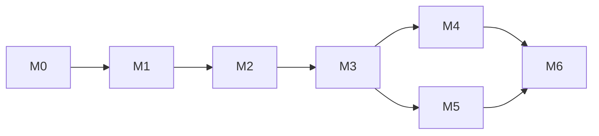

# 06 — Roadmap and work breakdown

Milestones are sequential; work items inside a milestone are ordered by dependency.
Sizes: S ≤ ½ day, M ≈ 1–2 days, L ≈ 3–5 days of focused work (human + agent).
IDs (`LO-nn`) match the Korean issue backlog in `07-backlog.ko.md`.

## M0 — Repository bootstrap

Goal: a clean fork that builds nothing yet but has every convention in place.

| ID | Item | Size | Acceptance |
|----|------|------|------------|
| LO-01 | Create repo from upstream `lib/`, `assets/`, `pubspec.yaml`, `analysis_options.yaml`, `ios/` (minus Finder duplicates, `OmiLocal/`, `.ralph/`, logs, scripts). Keep upstream git history via `git filter-repo` or start fresh with attribution in `LICENSE`. | S | `git log` clean; `LICENSE` has both copyright lines |
| LO-02 | Pin toolchain: `mise.toml` (flutter stable, java 17), `.fvmrc` optional; `docs/` and `AGENTS.md` committed | S | `mise install && flutter doctor` clean on a fresh clone |
| LO-03 | Rename app: `libreomi` package, `org.libreomi.app` id (placeholder until owner decides), app label "LibreOmi", new icon assets | S | `flutter analyze` passes |
| LO-04 | CI: GitHub Actions running `flutter analyze` + `flutter test` + `flutter build apk --debug` on PR | M | green on main |
| LO-05 | Issue/PR templates (Korean), labels, milestones created via `scripts/create_issues.sh` | S | backlog visible on GitHub |

## M1 — Android build bring-up (first live transcript)

Goal: Omi → Android phone → Deepgram → text on screen, app in foreground.

| ID | Item | Size | Acceptance |
|----|------|------|------------|
| LO-10 | `flutter create --platforms=android`; minSdk 26 / target 35; Kotlin DSL; `abiFilters arm64-v8a` for debug | S | `flutter run` launches the upstream UI on a phone |
| LO-11 | AndroidManifest permissions per `04 §3`; `permission_handler` flows for BLE (31+ vs ≤ 30), notifications (33+) | M | Scan button works on Android 12+ and Android 10 |
| LO-12 | BLE: `requestMtu(512)` + connection priority after connect; cache characteristics; verify 83-byte packets in logs | M | Audio packets arrive intact (log packet length = 83) |
| LO-13 | Notifications: Android small icon, remove missing sound resource, channel review | S | Instant notification shows on Android 13+ |
| LO-14 | Deepgram live path end-to-end on Android; fix usage accounting (`is_final` only) | S | Live transcript appears within 2 s of speech |
| LO-15 | Phone-mic path on Android (`RECORD_AUDIO`, `record` PCM16 stream) | S | Transcript from phone mic works |
| LO-16 | Conversation finalization (OpenAI summarise → memories/tasks → SQLite) verified on Android; task reminder scheduled with inexact alarm | S | Conversation appears in History with title/summary |
| LO-17 | Device settings page verified (battery, firmware, gain, dim, haptic) | S | All reads/writes succeed |

Exit criteria: 30-minute foreground session with no crash; conversation saved.

## M2 — Background reliability

Goal: screen off / app backgrounded for hours, transcript still captured.

| ID | Item | Size | Acceptance |
|----|------|------|------------|
| LO-20 | `BackgroundRunner` abstraction + `flutter_foreground_task` implementation (`connectedDevice|microphone`), persistent notification with state | M | Session survives 1 h with screen off |
| LO-21 | Battery-optimisation exemption prompt + OEM guidance page (`device_info_plus`) | S | Prompt appears once; guidance links per vendor |
| LO-22 | Reconnect strategy: `autoConnect: true` for saved device, exponential backoff for scans, GATT 133 retry, subscription cleanup on disconnect | M | Walk out of range and back: reconnects within 30 s, audio resumes |
| LO-23 | Network retry queue for finalization (Deepgram/OpenAI calls during Doze) | M | Airplane mode during silence timeout → conversation summarised after network returns |
| LO-24 | Wake lock while listening; service stops when idle | S | No persistent notification when disconnected |
| LO-25 | Secure storage for API keys with migration | S | Keys survive upgrade; not readable in `shared_prefs` XML |

Exit criteria: overnight (8 h) session on a Samsung phone captures conversations without manual intervention.

## M3 — Core refactor and tests

Goal: dissolve `AppProvider` into the architecture in `03-architecture.md` so later work is testable.

| ID | Item | Size | Acceptance |
|----|------|------|------------|
| LO-30 | `core/` models incl. `TranscriptSegment.startAt/endAt`; `omi_gatt.dart` parsers with unit tests (audio header, button, storage list, storage packets) | M | tests green |
| LO-31 | `OmiDevice` interface + `OmiBleDevice` + `FakeOmiDevice` replay; debug "capture BLE session" toggle writes fixtures | L | pipeline runs from fixture on desktop `flutter test` |
| LO-32 | `AudioSource`, `StreamingTranscriber`, `LlmClient` interfaces; existing services adapted | M | no behaviour change on device |
| LO-33 | `RecordingSession` + `ButtonHandler` + `SilenceDetector` state machines with unit tests; single `ConversationFinalizer` (removes duplication) | L | hold-to-ask and double-tap pass tests + device smoke |
| LO-34 | Split UI controllers (`DeviceController`, `SessionController`, `LibraryController`, `ChatController`); pages re-pointed | M | all pages work; `AppProvider` deleted |
| LO-35 | Repos + schema v4 (`notification_id` column, persisted chat) with migration test | S | upgrade from v3 DB keeps data |

## M4 — On-device transcription on Android

| ID | Item | Size | Acceptance |
|----|------|------|------------|
| LO-40 | `model_store.dart`: download with progress, checksum, cancel, delete; models under app-support dir; Settings UI for size/delete | M | Download tiny model, see progress, delete |
| LO-41 | Sherpa streaming Zipformer in a background isolate; wall-clock timestamps per endpoint | M | UI stays 60 fps while transcribing; durations shown |
| LO-42 | Whisper batch + Silero VAD (sherpa-onnx) replacing the 3 s timer; timestamps | M | No mid-word cuts on a 2-minute test |
| LO-43 | Codec-aware routing: Opus decode only when the transcriber needs PCM | S | Deepgram path unchanged |
| LO-44 | Multilingual model option (e.g. sherpa zipformer multilingual / whisper multilingual) for Korean | M | Korean speech transcribed offline |

## M5 — SD-card sync completion

| ID | Item | Size | Acceptance |
|----|------|------|------------|
| LO-50 | `OmiStorage` transport: list, read with progress, stop (`0x03`), clear; robust to 83/440-byte packets | M | 5-minute recording syncs with progress bar |
| LO-51 | `FileTranscriber`: Deepgram pre-recorded API (WAV upload) and sherpa offline; `.bin` → WAV decode | M | Synced file becomes a conversation with summary |
| LO-52 | SD-card page: pending size/duration, sync, process, delete, storage usage | S | matches upstream UX, no placeholders |

## M6 — Polish and release

| ID | Item | Size | Acceptance |
|----|------|------|------------|
| LO-60 | Settings: OpenAI-compatible base URL + model list; Deepgram model select; pricing table editable | S | Ollama/OpenRouter usable |
| LO-61 | Export/import JSON (share sheet + file picker) | S | round-trip keeps all rows |
| LO-62 | i18n scaffolding (`flutter_localizations`), English + Korean strings | M | language follows system |
| LO-63 | Release engineering: signing config via env, `--split-per-abi` APKs to GitHub Releases, App Bundle for Play internal testing, CHANGELOG | M | v0.1.0 tag produces downloadable APK |
| LO-64 | Privacy/permissions rationale screen (Play "Sensitive permissions" prompt-declaration ready) | S | text reviewed |
| LO-65 | iOS re-verification build (no new features) | S | `flutter build ios` succeeds |

## Later (not scheduled)

- Speaker profiles / diarisation for local STT
- Calendar / Notion integrations (upstream roadmap)
- Companion Device Manager pairing for stronger background guarantees
- Native Kotlin BLE service if `flutter_foreground_task` proves insufficient on some OEMs
- Merge-back of Android support to upstream `omibutfree` if the maintainer is receptive

## Dependency graph

M4 and M5 are independent after M3 and can be developed in parallel branches.
